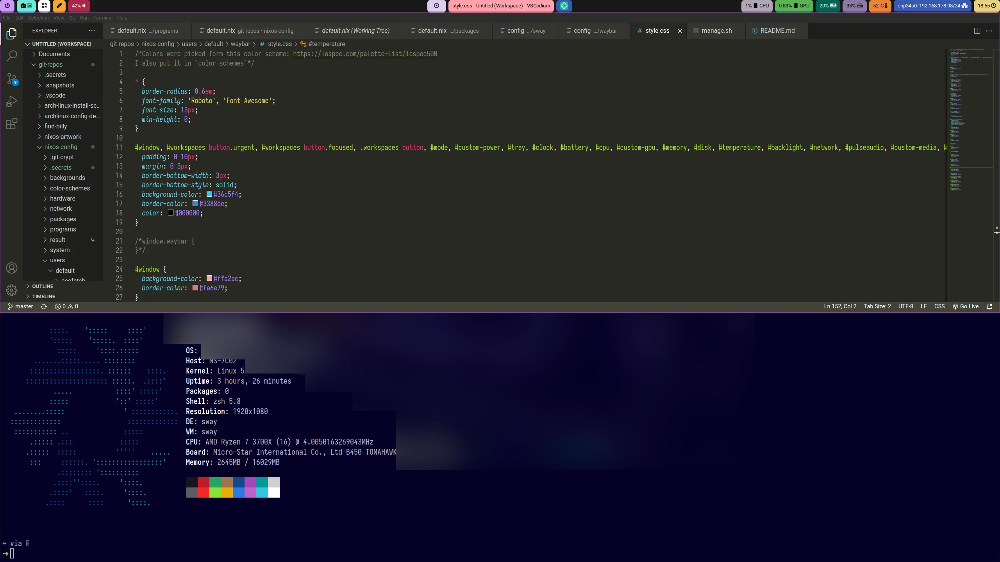

<div align="center">

<h1>papojari's NixOS configuration</h1>

<p>
  <a href="https://nixos.org/"></a>
  <a href="https://swaywm.org/"></a>

[](https://builtwithnix.org)

This repository contains my NixOS desktop configuration files. Other than the `*.nix` files you will be able to use all of the files on other operating systems like BSD, macOS or any of the other Linux distributions.

</div>

---



## Stuff used

### Programs

| Type of program      | Type of programs used                                                              |
| -------------------- | ---------------------------------------------------------------------------------- |
| OS                   | [NixOS](https://nixos.org/)                                                        |
| Shell                | [Zsh](https://en.wikipedia.org/wiki/Z_shell/)                                      |
| Display manager      | [GDM](https://wiki.archlinux.org/title/GDM/)                                       |
| Wayland compositor   | [sway](https://swaywm.org/)                                                        |
| Status bar           | [Waybar](https://github.com/Alexays/Waybar/)                                       |
| Application launcher | [Wofi](https://hg.sr.ht/~scoopta/wofi/)                                            |
| Terminal emulator    | [Alacritty](https://github.com/alacritty/alacritty/)                               |
| Text editor          | [VSCodium](https://vscodium.com/), [Kakoune](https://kakoune.org/)                 |
| Web browser          | [Brave](https://brave.com/), [Firefox](https://www.mozilla.org/en-US/firefox/new/) |

### Fonts

- Roboto
- Font Awesome
- Iosevka (Nerdfont)

## Getting started

### Installing NixOS with my configuration

#### x86_64 architecture

1. Follow [NixOS unstable manual](https://nixos.org/manual/nixos/unstable/) until you have a working system.
2. Boot it without the installation medium.

#### Raspberry Pi 4 Model B

1. Follow this [nix.dev turorial](https://nix.dev/tutorials/installing-nixos-on-a-raspberry-pi) until you have a working system.
2. Boot from the disk.

### Building from the Nix files

Clone this repository to somewhere, for example: *your home directory*, like this

```bash
git clone https://codeberg.org/papojari/nixos-config.git
```

#### NixOS

Assuming you `cd`ed into the cloned git repository,

To execute `manage.sh` you might have to run
```bash
chmod +x manage.sh
```

My configuration is specifically made for two system so If you don't have a computer with an AMD CPU and an AMD Sea Islands GPU or a Raspberry Pi 4 you'll have to adjust some files.

What configuration will be built when you run
```bash
./manage.sh --apply-system
```
is determined by your hostname so change your hostname or the files depending or which should be built. To change your hostname you can change `networking.hostname` in `/etc/nixos/configuration.nix` to one of the hostnames in `flake.nix` (*Cryogonal* and *Cryogonull*) and then build it with
```bash
nixos-rebuild switch
```

#### Home Manager

```bash
./manage.sh --apply-users
```

### Backgrounds

#### Highway to shell


This is the default wallpaper. You just need to build the Home Manager configuration to look at it in sway.

#### 3d NixOS


- to install run

```bash
curl https://raw.githubusercontent.com/papojari/nixos-artwork/master/wallpapers/nix-wallpaper-3d-showcase-1920x1080.png --output backgrounds/nix-wallpaper-3d-showcase.png
```

- to use, uncomment the first `$Background` line and comment the next line in `users/default/sway/config`. Then rebuild with

```bash
./manage.sh --apply-users
```

### Sway

Before you starting to use sway you'll have to adjust the config to you monitor setup. To list your monitors run
```bash
swaymsg -t get_outputs
```
and then put the identifiers like `DP-1` or `HDMI-A-1` into `users/default/sway/config` in the `Output configuration` section. Then rebuild with

```bash
./manage.sh --apply-users
```

You can just start *sway* with `sway` in a tty. Alternatively start *sway* from a display manager. In my experience, despite what the wiki says, *gdm* works.

### How to hide your secrets in this repository

If you want to fork this repository and configure it to your liking you may want to put secrets in some files. I've put mine in `.secrets.tar.age`. This file is useless to you since it is encrypted. if you think that before `tar` and `age` the secrets might've been in `.secrets`, you're correct. So, put your secrets in `.secrets`. If there are nix files in it link them in `flake.nix`. Before doing commits with `git` you should run
```bash
./manage.sh --lock
```
to encrypt the secrets with a password. Otherwise your secrets won't be secrets anymore so be careful. Put that password in a password manager like Bitwarden. You'll need it to unencrypt your secrets with
```bash
./manage.sh --unlock
```
as you might've guessed by now.

## Licenses

[View this repository's licenses](Licenses.md)

## Credits

Thanks [Wil Taylor](https://github.com/wiltaylor) for teaching me nix flakes and `git crypt` in [your awesome tutorial series](https://www.youtube.com/watch?v=QKoQ1gKJY5A&list=PL-saUBvIJzOkjAw_vOac75v-x6EzNzZq-)!