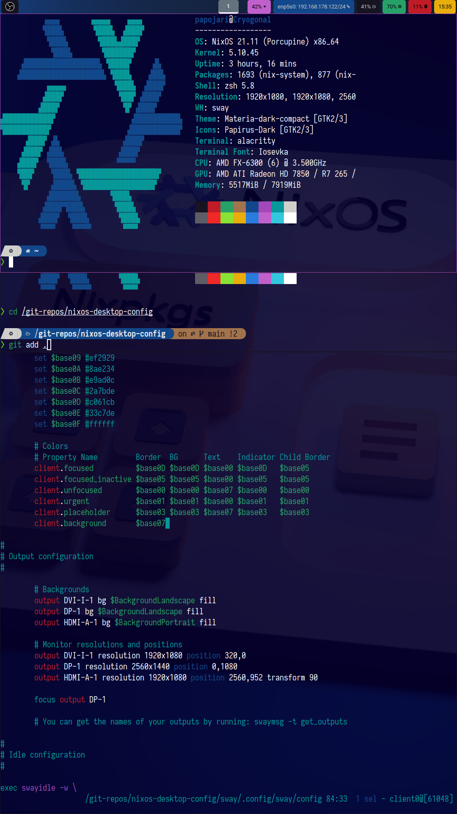

# papojari's NixOS configuration

## Preview

## ToC

<!-- TOC depthFrom:1 depthTo:6 withLinks:1 updateOnSave:1 orderedList:0 -->

- [papojari's NixOS configuration](#papojaris-nixos-configuration)
	- [Preview](#preview)
	- [ToC](#toc)
	- [Installation](#installation)
		- [Build `configuration.nix`](#build-configurationnix)
			- [From the machine](#from-the-machine)
			- [From installation medium](#from-installation-medium)
		- [Backgrounds](#backgrounds)
		- [Linking my dotfiles with `stow`](#linking-my-dotfiles-with-stow)
		- [Wayland](#wayland)
			- [lxappearance](#lxappearance)

<!-- /TOC -->

Note that the `nixos/configuration.nix` is specifically tailed to and AMD CPU and an AMD Sea Islands graphics card. Change it depending on your hardware.

## Installation

### Build `configuration.nix`

More information at [NixOS unstable manual](https://nixos.org/manual/nixos/unstable/)

#### From the machine

	wget https://gitlab.com/papojari/config/-/raw/master/configuration.nix && cp configuration.nix /etc/nixos/ && nixos-rebuild switch

#### From installation medium

	wget https://gitlab.com/papojari/config/-/raw/master/configuration.nix && cp configuration.nix /mnt/etc/nixos/ && nixos-install

### Backgrounds

Everything from here on should be done one the machine, which you installed NixOS with my `configuration.nix` on.

- 3d NixOS background

	

	- to install run

	git clone https://github.com/papojari/nixos-artwork.git && mkdir -p /usr/share/backgrounds/nixos && mv nixos-artwork/wallpapers/* /usr/share/backgrounds/nixos/ && rm -rf nixos-artwork

### Linking my dotfiles with `stow`

This command clones the repository into your home directory, `cd`'s into the `dotfiles` folder and simulates the *stowing*.

	cd && git clone https://gitlab.com/config/config.git && cd config && stow -nvSt ~ */

**NEXT COMMAND WILL OVERWRITE FILES YOU MIGHT ALREADY HAVE IN PLACE**

**The previous command told you what will be overwritten**

	stow -vSt ~ */

to recreate the symbolic links in the appropriate position in your home directory pointing to the `~/dotfiles` folder's files.

This way you have all the configuration files in one place. This makes publishing dotfiles to a repository very easy. If you wanted to you could add your own configuration files and link them with GNU Stow or just edit mine a bit.

Alternatively you could move every single file to its appropriate position given in the repository. For that you would manually have to create all the folders which is time consuming so GNU Stow makes much sense here.

### Wayland

Before you start **sway** adjust `~/config/sway/.config/sway/config` to you monitor setup. You can just start **sway** with `sway` in a tty. Alternatively start **sway** from a display manager. In my experience, despite what the wiki says, **gdm** has worked.

#### lxappearance

- In sway open `lxappearance`and set either **Materia-dark-compact** as the GTK theme.
- Then set one of the **Papirus** icons themes depending on if you use a dark or light GTK theme or not and as your mouse cursor, select **Capitaine Cursors**.
